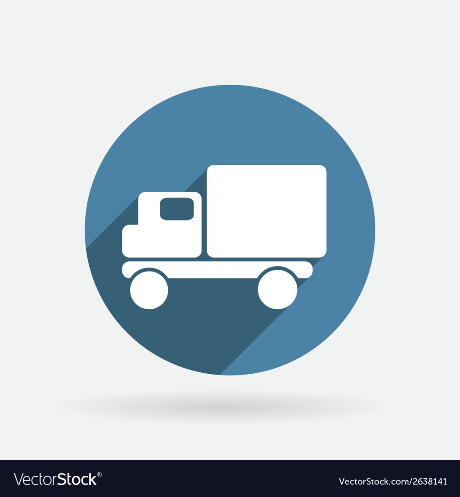

<div id="top"></div>


<!-- PROJECT LOGO -->
<br />
<div align="center">
  <a href="https://github.com/beyzanurakin/logisticAPI">
    
  </a>

<h3 align="center">logisticAPI</h3>


<!-- GETTING STARTED -->
## Getting Started

This is an example of how you may give instructions on setting up your project locally.
To get a local copy up and running follow these simple example steps.


### Installation

1. Get a free API Key at [https://example.com](https://example.com)
1. Clone the repo
   ```sh
   git clone https://github.com/beyzanurakin/logisticAPI.git
   ```
2. Install NPM packages
   ```sh
   npm install
   ```
